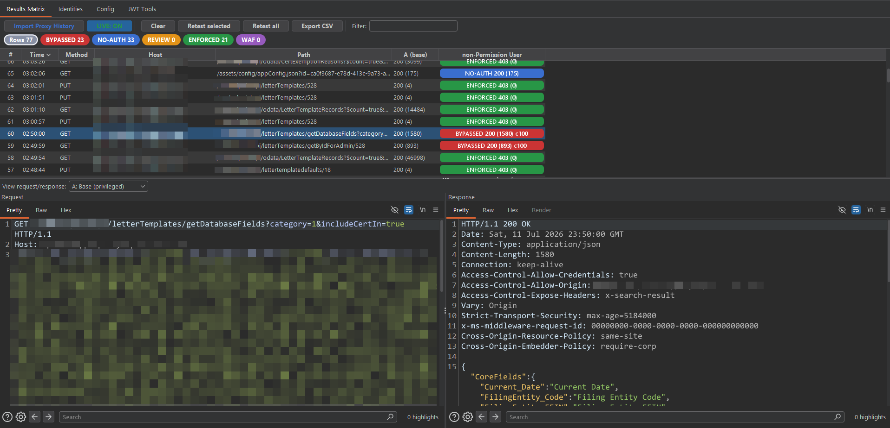

# 🔐 Authz-ExeC

**A Burp Suite extension for cross-identity / cross-tenant access-control testing — BAC, IDOR, BOLA, and privilege escalation.**


Authz-ExeC replays every request you make as a **privileged user** using each **identity** you
configure (a low-privilege user, a second tenant, unauthenticated), compares each response against
the privileged one, and shows a live colour matrix of where access control **held**, **broke**, or
**needs review**. Think Autorize / AuthMatrix — rebuilt on the modern Montoya API, hardened against
false positives, with first-class **multi-tenant** and **GraphQL** support.

## 🎬 Demo

<p align="center">
  
</p>

> _Add a screenshot at `docs/screenshot.png` — the Results Matrix tab makes a great one._

## ✨ Features

**⚡ Core**

- 🧮 **Matrix view** — rows are endpoints, columns are identities. Each cell is a colour-coded verdict
  (BYPASSED / ENFORCED / REVIEW / NO-AUTH / WAF).
- 📥 **Two ways to feed it:** one-click **Import Proxy History (in scope)**, or arm **LIVE** and browse.
- 🎭 **Identities** — swap `Cookie`, `Authorization` (JWT), and arbitrary headers (`X-Tenant-Id`,
  `X-Api-Key`, …), strip all auth (unauthenticated), or apply regex **ID-rewrite** rules for BOLA.
- 🔎 **Request/response viewer** per identity, colour count chips that double as **click-to-filter**, a
  free-text/time filter, CSV export, and a **JWT decoder** (`alg:none` / strip-signature helpers).

**🎯 Accuracy (low false-positive)**

- 🧠 **Three-state model** (privileged A / identity B / unauthenticated C) — a real bypass needs
  *B looks like A* **and** *C was refused*. If C also succeeds the endpoint is simply **public**.
- 🧹 **Body normalisation** — strips timestamps, UUIDs, CSRF/nonce tokens, and trace-ids before diffing.
- 📊 **JSON key-set** similarity, weighted-token similarity, and length tolerance.
- 🐤 **Canary markers** — tag a string unique to each tenant; a foreign marker appearing in another
  identity's response is near-proof of a cross-tenant leak.
- 🛡️ Guards for **WAF / rate-limit** blocks, **soft errors** (`200` + "access denied"), **empty
  results** (row-level filtering), and **login redirects**. Per-verdict **confidence score**.

**🧩 Coverage**

- 📡 **GraphQL** — auto-tests POST queries (even with POST off); mutations gated behind a write method.
- 🗂️ **API mode** — tests JSON, files/images (IDOR objects), XML, and empty/`204`/header-based
  responses; skips only rendered HTML pages.
- 🔁 **Value-aware de-dup** — same path with different parameter **values** (or different GraphQL
  queries) are each tested, while identical requests are never re-sent (persisted per project).
- 🙈 **Skips your identities' own browsing** — a request carrying a configured identity's session token
  is ignored, so browsing *as* the low-priv user doesn't create low-priv base rows.

**🧰 Workflow**

- 💾 **Presets** — save/load all identities + config to a portable `.properties` file.
- ♻️ **Retest** selected/all rows, **Send to Authz-ExeC** context-menu action, per-project persistence.

## 🧠 How detection works

For each captured request the engine sends and compares three responses:

| State | What it is                                                                        |
| ----- | --------------------------------------------------------------------------------- |
| **A** | the **privileged** response you captured (the "full access" template)             |
| **B** | the same request replayed with the **identity under test**'s auth                 |
| **C** | the same request with **all auth stripped** (the "denied / no-identity" template) |

A real access-control bypass requires **B ≈ A** *and* **C ≠ A** (unauthenticated was refused). If C
also equals A, the endpoint never had a control — it's simply public.

| Verdict      | Colour    | Meaning                                                                      |
| ------------ | --------- | ---------------------------------------------------------------------------- |
| **BYPASSED** | 🔴 red    | The identity got access it should not have (privilege / cross-tenant break). |
| **ENFORCED** | 🟢 green  | Properly denied, empty-filtered, or silently rescoped to its own data.       |
| **REVIEW**   | 🟠 orange | Ambiguous — inspect manually.                                                |
| **NO-AUTH**  | 🔵 blue   | Served even without any session (public / missing authentication).           |
| **WAF/RL**   | 🟣 purple | WAF or rate-limit block — infrastructure, not app authz.                     |

## 📋 Requirements

- 🧷 **Burp Suite** Professional **or** Community (the Montoya API is bundled — no download needed).
- ☕ To build from source: a **JDK 17 or newer**. No Gradle/Maven required.

## 🚀 Installation

### 📦 Option A — prebuilt jar (fastest)

1. Download [`release/Authz-ExeC.jar`](release/Authz-ExeC.jar).
2. In Burp: **Extensions → Installed → Add**.
3. Extension type **Java** → select the jar.
4. A new top-level **Authz-ExeC** tab appears (Results Matrix · Identities · Config · JWT Tools).

### 🛠️ Option B — build from source

```bash
# Windows (PowerShell)
powershell -ExecutionPolicy Bypass -File build.ps1

# Git Bash / Linux / macOS
bash build.sh
```

Both scripts auto-locate `burpsuite.jar` and a JDK 17+, compile with **zero external dependencies**,
and produce `dist/Authz-ExeC.jar`. Load that jar in Burp as above.

> The build compiles against Burp's bundled Montoya API and targets Java 17 bytecode, so the extension
> loads on any modern Burp JRE.

## ⚡ Quick start

1. 🎭 **Identities** tab → add your low-priv user's **Cookie** and/or **Authorization** (JWT). Add a
   second identity for another tenant. Keep the auto-created **Unauthenticated** one.
2. 🎯 Set Burp **Target → Scope** — the tool only touches in-scope hosts.
3. 📥 **Results Matrix** tab → click **Import Proxy History** to test everything you've already browsed,
   **or** click **LIVE** and browse the app **as the privileged/admin user**.
4. 🔴 Red **BYPASSED** cells are findings. Click a count chip to filter; click a row to view the
   request/response for each identity. Export to CSV for reporting.

## 📡 GraphQL

GraphQL is POST to a single endpoint, so two things are handled automatically:

- ✅ **Queries** are auto-tested even when POST is off (they're safe reads). **Mutations** are detected
  and only tested once a write method is enabled.
- 🔁 **Value-aware de-dup** keys on the query/operation and variables, so every distinct query and
  object-id is its own row while identical calls are de-duplicated.

## ⚙️ Configuration reference

**Config** tab (all persisted):

| Setting                                  | Default           | Description                                                     |
| ---------------------------------------- | ----------------- | --------------------------------------------------------------- |
| Test traffic from                        | Proxy, Repeater   | Tool sources whose traffic is captured.                         |
| Only in scope                            | on                | Never touch out-of-scope hosts.                                 |
| Only requests that carry auth            | on                | Skip requests with nothing to swap.                             |
| API mode (skip HTML pages)               | on                | Test JSON/files/XML/empty/header responses; skip rendered HTML. |
| Skip a configured identity's own traffic | on                | Ignore requests you made *as* an identity.                      |
| Methods                                  | GET, POST         | Per-method replay set (used when "all methods" is off).         |
| **Test ALL methods except OPTIONS/HEAD** | **on**            | Replays every method incl. PUT/PATCH/DELETE + mutations.        |
| Auto-test GraphQL POST queries           | on                | Test GraphQL queries even with POST off.                        |
| Threads / Min interval / Max rows        | 4 / 250 ms / 2000 | Concurrency, rate limit, row cap.                               |
| Dry run                                  | off               | Capture candidates but send nothing.                            |
| Detector thresholds & fingerprints       | —                 | Similarity %, length tolerance, denial fingerprints, etc.       |

## 💾 Presets

**Identities → Save preset / Load preset** writes all identities + config to a portable UTF-8
`.properties` file (multi-line cookies/headers/rules preserved). The live-arm switch is intentionally
not saved.

## 🛡️ Safety & responsible use

- ⚠️ **Only test targets you are authorised to test.** This tool sends real, modified requests.
- 🧨 By default **all methods except OPTIONS/HEAD are replayed** — this includes **PUT / PATCH /
  DELETE** and **GraphQL mutations**, which *modify or delete data*. Untick **Test ALL methods** (or use
  **Dry run**) for read-only testing, and prefer a staging/UAT environment for destructive verbs.
- 🚦 Testing is **scope-restricted** and **rate-limited**; the tool's own replays never loop, and an
  endpoint that was already tested is never re-sent.

## ❓ Troubleshooting / FAQ

- 🟡 **POST / GraphQL requests don't appear.** Make sure the target is in **Burp scope**, the request
  carries auth, and (for GraphQL) *Auto-test GraphQL* is on. API mode tests empty/`204`/header-based
  responses too, so a POST with an empty body still shows.
- 🔁 **"Import" says nothing new.** Everything matching was already tested (it's remembered across
  reloads). Press **Clear** to reset and re-scan.
- 🟢 **Everything shows ENFORCED.** An identity's session may have expired — use **Identities → Check
  sessions** (or the JWT decoder) to confirm it's still live.
- 🟠 **Lots of REVIEW on one endpoint.** It may be non-deterministic; enable *double-send volatile
  detection* in Config, or verify manually.

## 📄 License

[MIT](LICENSE).

## ⚠️ Disclaimer

Authz-ExeC is provided for **authorised security testing and education only**. You are responsible
for ensuring you have explicit permission to test any target. The authors accept no liability for
misuse or for any damage caused by running this tool.
